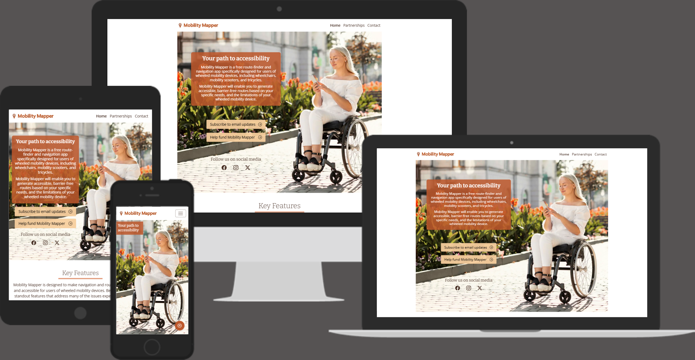

# Mobility Mapper

Mobility Mapper is a route finder and navigation app for users of wheelchairs, mobility scooters, tricycles and other wheeled mobility devices (referred to as wheelers). 

The purpose of this website is to gain the support needed to successfully develop and launch the app. It will generate interest by informing potential users, partners, and funders about its key features, and how it solves real-world way-finding problems for wheelers. 

In order to build a mailing list and social media following, the home page encourages visitors to subscribe to updates and follow our Facebook, Instagram and X pages. In addition, a contact form invites potential users to get in touch and provide feedback or ask questions about the app.

A page dedicated to partnerships and funding presents a business pitch, and invites those whose goals align with ours to contact us via a form or email.

Visit the deployed website [here](https://www.mobilitymapper.co.uk/).

### Typography

The main font used on the website is Open Sans with Sans Serif as the backup in case the former is not imported successfully. Bitter is used for the headings, as suggested by Figma as a complementary pairing with Open Sans, with Serif as the backup. 

## Technologies Used

### Languages Used
* [HTML5](https://en.wikipedia.org/wiki/HTML5)
* [CSS3](https://en.wikipedia.org/wiki/CSS)
* [Javascript](https://en.wikipedia.org/wiki/Javascript)

### Frameworks, Libraries and Programs Used

* [Google Fonts](https://fonts.google.com/) was used to import the fonts Open Sans and Bitter into the style.css file. Bitter was used for headings, and Open Sans for other text, including regular paragraphs, labels and links. 

* [Bootstrap](https://getbootstrap.com/) is an extensive library of CSS and JavaScript utilities. This website makes use of a wide range of pre-styled components such as buttons, forms, a modal, and navigation bar, along with a responsive grid system that simplifies the development of layouts for different screen sizes. Bootstrap enables consistent styling and behaviour across browsers, while also reducing the time and effort required to write custom code. 

    Bootstrap’s compiled CSS and JS was included via CDN by placing the jsdeliver `link` tag in the `<head>` for the CSS, and the `<script>` tag for the JavaScript bundle before the closing `<body>` tag.

* [Bootstrap Icons](https://icons.getbootstrap.com/) and [Font Awesome Icons](https://fontawesome.com/) were imported into the style.css file and used in both pages to create a better visual experience for UX purposes. 

* [Inkscape](https://inkscape.org/) was used to create the Mobility Mapper logo, and the wheel bullet icons.

* [GitHub](https://github.com/) was used as follows:
    - Together with Git for version control and code hosting.
    - This README file serves as the main documentation for the project. 

* [Am I Responsive?](https://ui.dev/amiresponsive) was used to view the  responsiveness of the website throughout the development process.

* [Am I Responsive (.co.uk)](https://amiresponsive.co.uk/) was used to generate the mockup images used at the top of this README.

* [Responsive Design Checker](https://www.responsivedesignchecker.com/)
    - Responsive Design Checker was used in the testing process to check responsiveness on various devices.

* [Chrome DevTools](https://developer.chrome.com/docs/devtools/) was used during the development process to:
    - view how the code renders in a web browser
    - evaluate how the code functions and ensure it behaves as expected
    - test responsiveness
    - debug and refine code

* [W3C Markup Validator](https://validator.w3.org/)
    - W3C Markup Validator was used to validate the HTML code.

* [W3C CSS Validator](https://jigsaw.w3.org/css-validator/)
    - W3C CSS Validator was used to validate the CSS code.

[Back to top ⇧](#mobility-mapper)

### Tools Testing

* [Chrome DevTools](https://developer.chrome.com/docs/devtools/) was used during the development process to:
    - view how the code renders in a web browser
    - evaluate how the code functions and ensure it behaves as expected
    - test responsiveness
    - debug and refine code

## Credits 

### Content

- All content was written by the developer.

### Media

- Both pages
    - Mobility Mapper logo: Created by the developer in Inkscape

- Home page images
    - Home page cover: "Woman in wheelchair in the city using smartphone" by [Freepik]{www.freepik.com)
    - Avoid Barriers: [Jewish Special Needs Blog](https://jewishspecialneeds.blogspot.com/)
    - Tailor routes to your needs: GH Photography
    - Locate dropped kerbs and ramps: Sonya Ridden
    - Locate accessible points of interest: Torbay Council
    - Report barriers and dropped kerbs: Created by Sonya Ridden in Inkscape with a screenshot from [Open Street Maps](https://www.openstreetmap.org/)
    - Connect with other wheelers: by Matt Walker

- Partnerships page images
    - Partnerships page cover image: "Hands holding puzzle business problem solving concept" by [Freepik]{www.freepik.com)
    - Steps: [Pixabay](https://pixabay.com/)
    - Steep Hills: [Pexels](https://www.pexels.com/)
    - Narrow paths: Sonya Ridden
    - Rough Surfaces: [Pixabay](https://pixabay.com/)
    - No Dropped Kerbs: [Pexels](https://www.pexels.com/)
    - Motorised Vehicle Barriers: University of Westminster
    - Stuck-at-home image: [Pexels](https://www.pexels.com/)
    - Parents and carers with prams and pushchairs: [Pexels](https://www.pexels.com/)
    - Cargo bike riders: [Pexels](https://www.pexels.com/)
    - Travellers with wheeled suitcases: [Pexels](https://www.pexels.com/)
    - Electric kick scooter: [Pexels](https://www.pexels.com/)