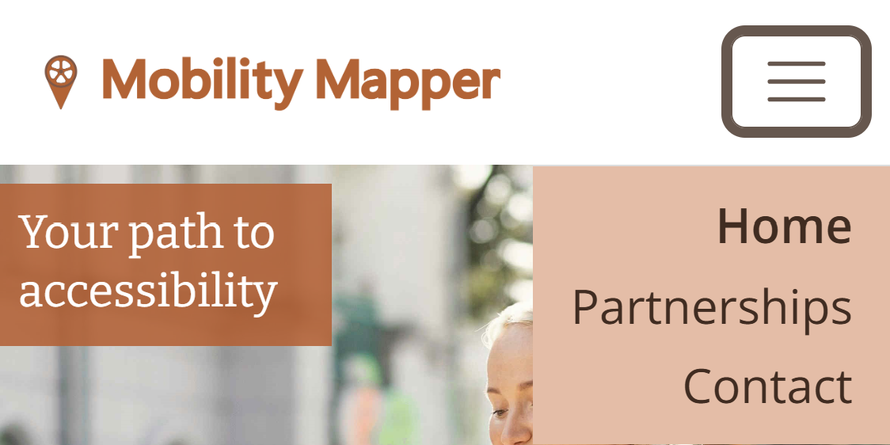
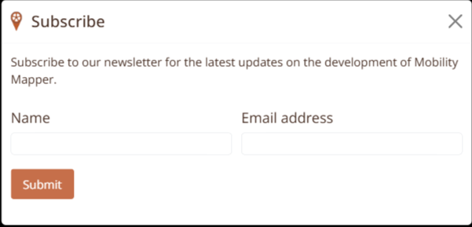
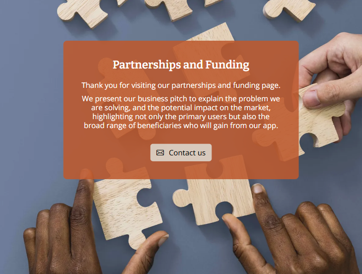
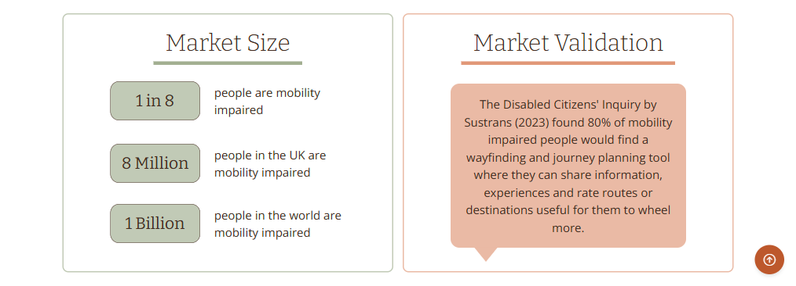
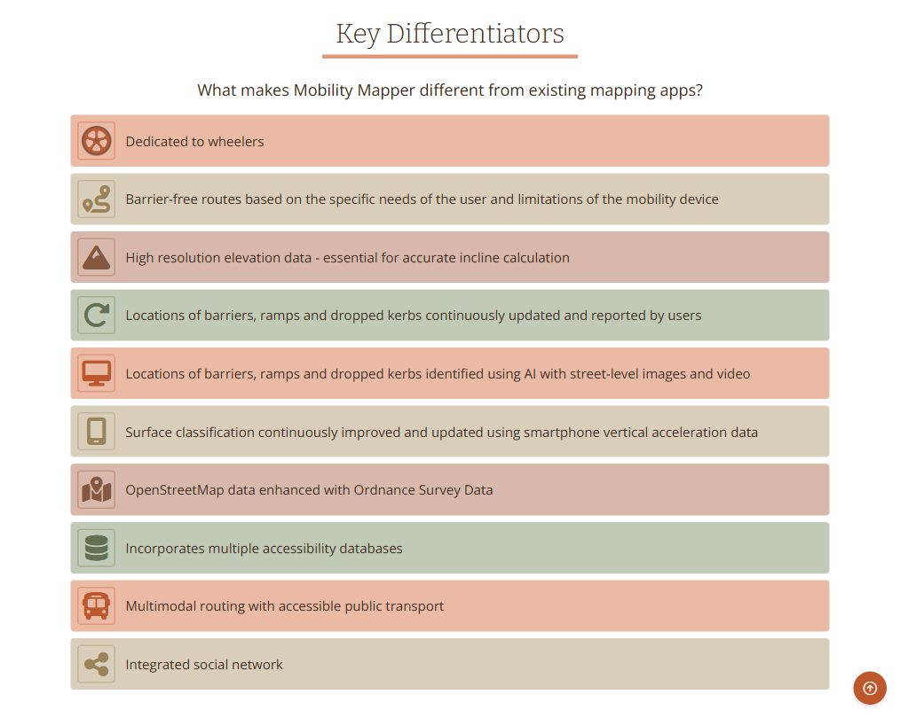

# Mobility Mapper

Mobility Mapper is a route finder and navigation app for users of wheelchairs, mobility scooters, tricycles and other wheeled mobility devices (referred to as wheelers). 

The purpose of this website is to gain the support needed to successfully develop and launch the app. It will generate interest by informing potential users, partners, and funders about its key features, and how it solves real-world wayfinding problems for wheelers. 

In order to build a mailing list and social media following, the home page encourages visitors to subscribe to updates and follow our Facebook, Instagram and X pages. In addition, a contact form invites potential users to get in touch and provide feedback or ask questions about the app.

A page dedicated to partnerships and funding presents a business pitch, and invites those whose goals align with ours to contact us via a form or email.

Visit the deployed website [here](https://sonyajane.github.io/mobility-mapper/).

## Table of Contents

TODO

***

## User Experience (UX)

### Business Goals

* Gain the support needed to successfully develop and launch the Mobility Mapper app.
* Generate interest by informing potential users about its key features.
* Build a mailing list and social media following. 
* Encourage potential users to submit feedback or ask questions about the app.
* Attract partners and funding by presenting our business pitch, and inviting those whose goals align with ours to contact us.

### User Stories

* As a first-time visitor, I need a user-friendly design with a responsive layout for my device so that I can easily access information and browse the site without frustration, regardless of the device or screen size I'm using.
* As a first-time visitor, I need clear, easy-to-use navigation so I can find the information I need quickly.
* As a busy carer of a mobility impaired person, I want to quick overview of mobility mapper so that I can determine if it's the kind of tool I'm looking for, and if it's worth my time learning more about it.
* As a user of a wheeled mobility device, I want to learn about all the features of Mobility Mapper so that I can decide if the app will suit my needs.
* As a potential funder, partner, or stakeholder, I want to understand the value, impact, and business potential of the Mobility Mapper app so that I can evaluate whether it aligns with my goals and is worth my support or aligns with our funding objectives.
* As a potential user or supporter, I want to sign up for updates about the app’s progress and launch so I can stay informed and be notified when the app is available.
* As a social media user, I want to easily follow the Mobility Mapper app’s progress on platforms like Facebook so I can engage with the community and get regular updates.

### Color Scheme

The primary colour used on the website is burnt orange, which is the same colour used for the app logo. Orange was chosen because it is associated with energy, happiness, and vitality. Since orange lends itself well to other colours found in nature, it is complmented with a muted yellow, coffee brown, khaki green, and a light shade of yellow-brown. 

The muted yellow is used for the call-to-action buttons that sit on the cover image, to differentiate them from the cover text background. 

Coffee brown is the colour theme of the contact forms, with a submit button of the same colour, and a lighter shade for the background, which nicely complements the light shade of orange that colours the footer directly below.

The khaki green adds variety, and is used as a complementary background for text on an image on the partnerships page. It also appears in a lighter shade as a text background in two sections further down the page.

Finally, the yellow-brown provides additional variety for the background colours of a set of list items.

### Typography

The main font used on the website is Open Sans with Sans Serif as the backup in case the former is not imported successfully. Bitter is used for the headings, as suggested by Figma as a complementary pairing with Open Sans, with Serif as the backup.
pairs well with  

### Wireframes

Wireframes were created using [Balsamiq](https://balsamiq.com/) to plan the design of the website for mobile, tablet and desktop screens.
Page | Mobile | Tablet | Desktop
--- | --- | --- | ---
Home |  |  | 
Partnerships |  |  | 

## Features

### General
* Responsive design across all device sizes.
* Similar color scheme and design throughout both pages to effectively structure, categorise and present the information to the visitors.

### Navbar

The navbar contains the Mobility Mapper logo on the left, which functions as a link to the home page.

Responsive navigation links are on the right of the navbar. On tablets and desktop screens the navigation links are visible:

On mobile screens the navigation links can be revealed by clicking a toggle button with a hamburger icon:

|  |  |
| --- | --- |
|  | toggle button unclicked |
|  | toggle button clicked |

The navigation bar is the same on both pages. It contains links to both pages to facilitate navigation across the site. It also contains a link to the contact form on the same page, so the contact link on the home page takes you to the personal contact form at the bottom of the home page, and the contact link on the partnerships page takes you to the business contact form at the bottom of the partnerships page. 

The navigation links have a hover effect that changes their colour to orange, to provide feedback to the user for a better user experience. In addition, the current page is indicated by bold font.

### Footer

The footers contain links to the social media channels, and convenient, relevant links for easy navigation.

The home page footer contains links to the top of the page, the email subsciption modal, the home contact form, and the partnerships page.

The partnerships page footer contains links to the home page, the top of the page, and the partnerships contact form.

### Home Page

The home page consists of four sections and a subscribe modal.

#### 1. Hero cover image and text

Visitors are greeted by a light and sunny hero image, which stretches with the screen width.

On mobile screens the image is accompanied by a prominent cover title, and the cover text sits below it, followed by two call-to-action buttons and a set of social media links. These features sit ontop of the hero image on tablet and desktop screens.

- The hero image shows a happy wheelchair user using the app on her mobile phone.

- The cover text consists of a concise overview of the purpose of Mobility Mapper and how it benefits users of wheeled mobility devices. 

- The first call-to-action button invites the visitor to subscribe to email updates, and the second to learn more about how they can help fund the development of the app.

- The social media buttons take the visitor to the Mobility Mapper Facebook page, Instagram account, or X page.

| Desktop and tablet | Mobile |
| --- | --- |
|  |    |

#### 2. Key features section

This section describes the key features of the app. It consists of six cards, one for each feature, with an image, feature title and description.

#### 3. Seeking partnerships section

The purpose of this section is to guide potential partners and funders to the partnerships page.

#### 4. Contact section

This contact form is for potential users of the app to get in touch with us, with the option to subscribe to the email updates.

The message text area has a maximum length of 750 characters. A [Javascript event listener](assets/js/contact-personal.js#L1) counts the number of characters and displays that number below the text box, providing helpful feedback to the visitor.

When the "Submit contact form" button is clicked, the inputs are validated and another [Javascript event listener](assets/js/contact-personal.js#L11) gets the form inputs and posts them to a Google Sheets spredsheet via a Google Apps script.

#### Subscribe Modal

This modal is opened when the "Subscribe to email updates" call-to-action button in the hero section is clicked, or the "subscribe" link in the footer is clicked.

A small Mobility Mapper icon on the right of the header, and a submit button of the same colour reassures the visitor that the form belongs to the Mobility Mapper website.

When the "Submit" button is clicked, the inputs are validated and a [Javascript event listener](assets/js/subscribe.js) gets the form inputs and posts them to a Google Sheets spredsheet via a Google Apps script.

### Partnerships Page

The partnerships consists of eight sections.

#### 1. Hero cover image and text

The hero image depicts people working together to build a puzzle. 

It behaves similarly to the home page hero image, for consistency. It stretches with the screen width, and on mobile screens it is accompanied by a prominent cover title, with the cover text sitting below it, followed by a call-to-action button. These features sit ontop of the hero image on tablet and desktop screens.

- The cover text welcomes the visitor to the page and gives an overview of the contents of the page. 

- The call-to-action button invites the visitor to contact us, and on clicking it takes them to the business contact form at the bottom of the page.

| Desktop and tablet | Mobile |
| --- | --- |
|  |  |

#### 2. Contents

The contents section provides both a quick, easy to read overview of the contents of page, and enables the visitor to jump to a section of interest.

On mobile screens the contents are shown in a single column, and on tablets and desktops in two columns.

#### 3. The Problem

This section explains the problems that wheelers encounter when they follow routes generated by existing navigation platforms. 

Six types of barriers are presented as cards with an image and card title. On mobile screens the cards are shown in a single column, on tablets in two columns, and on desktops in three columns.

To prevent the monotony of multiple contiguous, plain blocks of text, two paragraphs are presented on a large image, which stretches with the screen size. The image shows a lady in a wheelchair looking out of the window, while stuck at home, due to a lack of knowledge of accessible routes.

#### 4. Our Solution

The solution section is presented as bullet points, with the Mobility Mapper wheel icon as the main bullets. The width of the container is limited so that the bulk of the text remains centered and balanced on wide screens (long sentences that sit on one line cause the majority of the text to shift to the left-hand-side of the screen).

#### 5. Market

Both the market size and validation sections are included here, since they are relatively small. On mobile screens the validation section sits below the market size section, and they appear side-by-side on tablets upwards.

The green-filled, rounded rectagles highlight the market size statistics, making them both easy to find and visually appealing. The maket validation text is contained in a speech bubble to represent the fact that disabled people were consulted on their view of the usefulness of an accessible wayfinding app. 

#### 6. Key Differentiators

The list of key differentiators explains what makes Mobility Mapper different from existing mapping platforms.

To make the list more visually appealing, each list item is presented on one of four different background colours, with a corresponding icon to promote better understanding. 

#### 7. Further Benefits

#### 8. Contact section

## Technologies Used

### Languages Used
* [HTML5](https://en.wikipedia.org/wiki/HTML5)
* [CSS3](https://en.wikipedia.org/wiki/CSS)
* [Javascript](https://en.wikipedia.org/wiki/Javascript)

### Frameworks, Libraries and Programs Used

* [Google Fonts](https://fonts.google.com/)
    - Google Fonts was used to import the fonts ...

* [GitHub](https://github.com/)
     - GitHub was used to ...

* [Balsamiq](https://balsamiq.com/)
     - Balsamiq was used to create the wireframes during the design phase of the project.

* [Responsive Design Checker](https://www.responsivedesignchecker.com/)
    - Responsive Design Checker was used in the testing process to check responsiveness on various devices.

* [Chrome DevTools](https://developer.chrome.com/docs/devtools/)
    - Chrome DevTools was used during the development process for...

* [W3C Markup Validator](https://validator.w3.org/)
    - W3C Markup Validator was used to validate the HTML code.

* [W3C CSS Validator](https://jigsaw.w3.org/css-validator/)
    - W3C CSS Validator was used to validate the CSS code.

## Testing

### Testing User Stories

### Code Validation

* The [W3C Markup Validator](https://validator.w3.org/) website was used to validate the CSS file to ensure there were no syntax errors. No errors or warnings were found.

* The [W3C CSS Validator](https://jigsaw.w3.org/css-validator/) website was used to validate both pages to ensure there were no syntax errors.

    -  list errors and warnings

### Accessibility

* Lighthouse in Chrome DevTools. Reports:

    - **Home Page**

    - **Partnerships Page**

### Tools Testing

* [Chrome DevTools](https://developer.chrome.com/docs/devtools/)

    - Chrome DevTools was used during the development process to ...

* Responsiveness
    
    - [Responsive Design Checker](https://www.responsivedesignchecker.com/) was used to...
    
    - Chrome DevTools ...

    amiresponsive: revealed the cover title covers the head of the person in the image at screen size 320px
    was ok up to 380 - added media quire for < 380 to reposition image slightly and make text smaller
    also hamburger menu did not fit on same line as logo, so removed margin-right from
    .navbar-brand, and reduced logo size for tiney screens

### Manual Testing

* Browser Compatibility

    - The website has been tested on the following browsers:

        - **Google Chrome**
        
        - **Safari**
        
        - **Mozilla Firefox**
        
        - **Microsoft Edge**
        
* Device compatibility

    - The website has been tested on multiple devices, including:

        - **Lenovo Legion 7**

        - **iPad Pro XX"**

        - **Samsung Galaxy Ultra 22**

* Common Elements Testing

    - Both Pages
        
        - **Header**

        - **Navigation Bar**
        
        - **Footer**

    - Home Page

    - Partnerships Page

## Finished Product

Page |  Mobile | Tablet | Desktop
--- | --- | ---
Home |   |  | 

Partnerships |   |  | 

## Deployment

* This website was developed using [Visual Studio Code](https://code.visualstudio.com/), which was then committed and pushed to GitHub using the terminal.

### GitHub Pages

## Credits 

### Content

- All content was written by the developer.

### Media

* [Pexels](https://www.pexels.com/)

### Code

The introduction text is positioned below the hero image on small screens, and moves up onto it for medium screens and above.

The subscribe form posts the name and email to a Google spreadsheet. This is done by the subscribe.js script.

To achieve the layout, we uses a combination of HTML and Bootstrap for responsiveness, along with some custom CSS for styling. The solution includes:

Flexbox for aligning the content.
Bootstrap grid for responsiveness.
Media queries to adjust the layout for different screen sizes.
