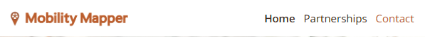
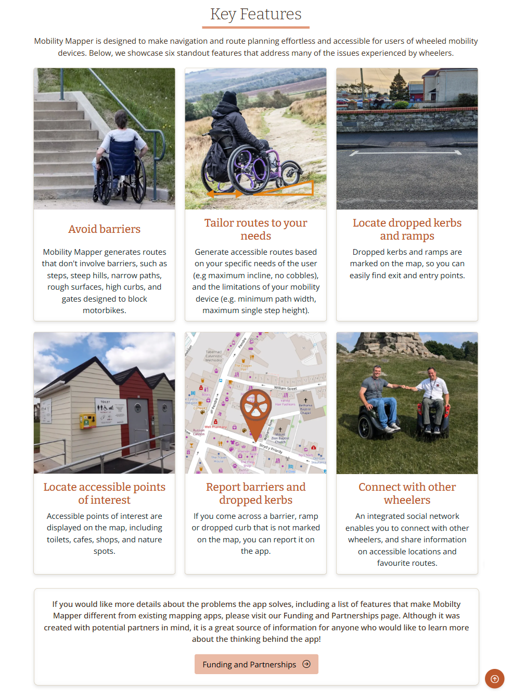
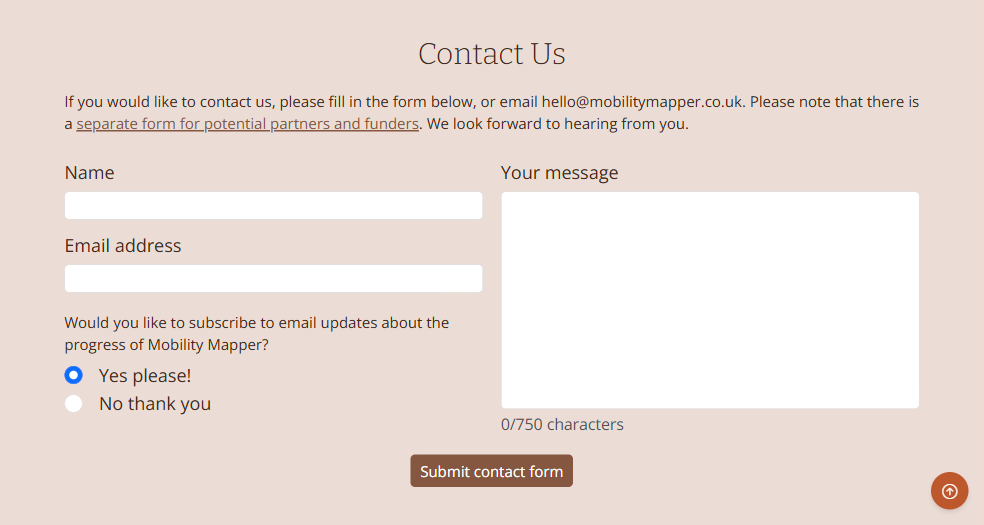
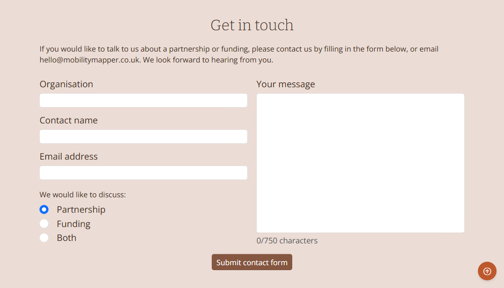

# Mobility Mapper

Mobility Mapper is a route finder and navigation app for users of wheelchairs, mobility scooters, tricycles and other wheeled mobility devices (referred to as wheelers). 

The purpose of this website is to gain the support needed to successfully develop and launch the app. It will generate interest by informing potential users, partners, and funders about its key features, and how it solves real-world wayfinding problems for wheelers. 

In order to build a mailing list and social media following, the home page encourages visitors to subscribe to updates and follow our Facebook, Instagram and X pages. In addition, a contact form invites potential users to get in touch and provide feedback or ask questions about the app.

A page dedicated to partnerships and funding presents a business pitch, and invites those whose goals align with ours to contact us via a form or email.

Visit the deployed website [here](https://sonyajane.github.io/mobility-mapper/).

## Table of Contents

TODO

***

## User Experience (UX)

### Business Goals

* Gain the support needed to successfully develop and launch the Mobility Mapper app.
* Generate interest by informing potential users about its key features.
* Build a mailing list and social media following. 
* Encourage potential users to submit feedback or ask questions about the app.
* Attract partners and funding by presenting our business pitch, and inviting those whose goals align with ours to contact us.

### User Stories

* As a first-time visitor, I need a user-friendly design with a responsive layout for my device so that I can easily access information and browse the site without frustration, regardless of the device or screen size I'm using.
* As a first-time visitor, I need clear, easy-to-use navigation so I can find the information I need quickly.
* As a busy carer of a mobility impaired person, I want to quick overview of mobility mapper so that I can determine if it's the kind of tool I'm looking for, and if it's worth my time learning more about it.
* As a user of a wheeled mobility device, I want to learn about all the features of Mobility Mapper so that I can decide if the app will suit my needs.
* As a potential funder, partner, or stakeholder, I want to understand the value, impact, and business potential of the Mobility Mapper app so that I can evaluate whether it aligns with my goals and is worth my support or aligns with our funding objectives.
* As a potential user or supporter, I want to sign up for updates about the app’s progress and launch so I can stay informed and be notified when the app is available.
* As a social media user, I want to easily follow the Mobility Mapper app’s progress on platforms like Facebook so I can engage with the community and get regular updates.

[Back to top ⇧](#mobility-mapper)

### Color Scheme

The primary colour used on the website is burnt orange, which is the same colour used for the app logo. Orange was chosen because it is associated with energy, happiness, and vitality. Since orange lends itself well to other colours found in nature, it is complmented with a muted yellow, coffee brown, khaki green, and a light shade of yellow-brown. 

The muted yellow is used for the call-to-action buttons that sit on the cover image, to differentiate them from the cover text background. 

Coffee brown is the colour theme of the contact forms, with a submit button of the same colour, and a lighter shade for the background, which nicely complements the light shade of orange that colours the footer directly below.

The khaki green adds variety, and is used as a complementary background for text on an image on the partnerships page. It also appears in a lighter shade as a text background in two sections further down the page.

Finally, the yellow-brown provides additional variety for the background colours of a set of list items.

### Typography

The main font used on the website is Open Sans with Sans Serif as the backup in case the former is not imported successfully. Bitter is used for the headings, as suggested by Figma as a complementary pairing with Open Sans, with Serif as the backup.
pairs well with  

### Wireframes

Wireframes were created using [Balsamiq](https://balsamiq.com/) to plan the design of the website for mobile, tablet and desktop screens.
Page | Mobile | Tablet | Desktop
--- | --- | --- | ---
Home |  |  | 
Partnerships |  |  | 

[Back to top ⇧](#mobility-mapper)

## Features

### General
* Responsive design across all device sizes.
* Similar color scheme and design throughout both pages to effectively structure, categorise and present the information to the visitors.

### Navbar

The navbar contains the Mobility Mapper logo on the left, which functions as a link to the home page.

Responsive navigation links are on the right of the navbar. On tablets and desktop screens the navigation links are visible, with the current page highlighted in orange with an orange font colour:

On mobile screens the navigation links can be revealed by clicking a toggle button with a hamburger icon:

|  |  |
| --- | --- |
|  | toggle button unclicked |
|  | toggle button clicked |

The navigation bar is the same on both pages. It contains links to both pages to facilitate navigation across the site. It also contains a link to the contact form on the same page, so the contact link on the home page takes you to the personal contact form at the bottom of the home page, and the contact link on the partnerships page takes you to the business contact form at the bottom of the partnerships page. 

The navigation links have a hover effect that changes their colour to orange, to provide feedback to the user for a better user experience. In addition, the current page is indicated by bold font.

### Footer

The footers contain links to the social media channels, and convenient, relevant links for easy navigation.

The home page footer contains links to the top of the page, the email subsciption modal, the home contact form, and the partnerships page.

The partnerships page footer contains links to the home page, the top of the page, and the partnerships contact form.

[Back to top ⇧](#mobility-mapper)

### Home Page

The home page consists of four sections and a subscribe modal.

#### 1. Hero cover image and text

Visitors are greeted by a light and sunny hero image, which stretches with the screen width.

On mobile screens the image is accompanied by a prominent cover title, and the cover text sits below it, followed by two call-to-action buttons and a set of social media links. These features sit ontop of the hero image on tablet and desktop screens.

- The hero image shows a happy wheelchair user using the app on her mobile phone.

- The cover text consists of a concise overview of the purpose of Mobility Mapper and how it benefits users of wheeled mobility devices. 

- The first call-to-action button invites the visitor to subscribe to email updates, and the second to learn more about how they can help fund the development of the app.

- The social media buttons take the visitor to the Mobility Mapper Facebook page, Instagram account, or X page.

| Desktop and tablet | Mobile |
| --- | --- |
|  |    |

#### 2. Key features section

This section describes the key features of the app. It consists of six cards, one for each feature, with an image, feature title and description.

#### 3. Seeking partnerships section

The purpose of this section is to guide potential partners and funders to the partnerships page.

#### 4. Contact section

This contact form is for potential users of the app to get in touch with us, with the option to subscribe to the email updates.

The message text area has a maximum length of 750 characters. A [Javascript event listener](assets/js/contact-personal.js#L1) counts the number of characters and displays that number below the text box, providing helpful feedback to the visitor.

When the "Submit contact form" button is clicked, the inputs are validated and another [Javascript event listener](assets/js/contact-personal.js#L11) gets the form inputs and posts them to a Google Sheets spredsheet via a Google Apps script.

#### Subscribe Modal

This modal is opened when the "Subscribe to email updates" call-to-action button in the hero section is clicked, or the "subscribe" link in the footer is clicked.

A small Mobility Mapper icon on the right of the header, and a submit button of the same colour reassures the visitor that the form belongs to the Mobility Mapper website.

When the "Submit" button is clicked, the inputs are validated and a [Javascript event listener](assets/js/subscribe.js) gets the form inputs and posts them to a Google Sheets spredsheet via a Google Apps script.

[Back to top ⇧](#mobility-mapper)

### Partnerships Page

The partnerships consists of eight sections.

#### 1. Hero cover image and text

The hero image depicts people working together to build a puzzle. 

It behaves similarly to the home page hero image, for consistency. It stretches with the screen width, and on mobile screens it is accompanied by a prominent cover title, with the cover text sitting below it, followed by a call-to-action button. These features sit ontop of the hero image on tablet and desktop screens.

- The cover text welcomes the visitor to the page and gives an overview of the contents of the page. 

- The call-to-action button invites the visitor to contact us, and on clicking it takes them to the business contact form at the bottom of the page.

| Desktop and tablet | Mobile |
| --- | --- |
|  |  |

#### 2. Contents

The contents section provides both a quick, easy to read overview of the contents of page, and enables the visitor to jump to a section of interest.

On mobile screens the contents are shown in a single column, and on tablets and desktops in two columns.

#### 3. The Problem

This section explains the problems that wheelers encounter when they follow routes generated by existing navigation platforms. 

Six types of barriers are presented as cards with an image and card title. On mobile screens the cards are shown in a single column, on tablets in two columns, and on desktops in three columns.

To prevent the monotony of multiple contiguous, plain blocks of text, two paragraphs are presented on a large image, which stretches with the screen size. The image shows a lady in a wheelchair looking out of the window, while stuck at home, due to a lack of knowledge of accessible routes.

#### 4. Our Solution

The solution section is presented as bullet points, with the Mobility Mapper wheel icon as the main bullets. The width of the container is limited so that the bulk of the text remains centered and balanced on wide screens (long sentences that sit on one line cause the majority of the text to shift to the left-hand-side of the screen).

#### 5. Market

Both the market size and validation sections are included here, since they are relatively small. On mobile screens the validation section sits below the market size section, and they appear side-by-side on tablets upwards.

The green-filled, rounded rectagles highlight the market size statistics, making them both easy to find and visually appealing. The maket validation text is contained in a speech bubble to represent the fact that disabled people were consulted on their view of the usefulness of an accessible wayfinding app. 

#### 6. Key Differentiators

The list of key differentiators explains what makes Mobility Mapper different from existing mapping platforms.

To make the list more visually appealing, each list item is presented on one of four different background colours, with a corresponding icon to promote better understanding. 

#### 7. Further Benefits

This section showcases who else will benefit from the app, starting with four large-scale entities, and followed by four different groups of people using wheeled devices.

Both sets are displayed in a single column on mobile screens. The first set expands to two columns on desktops. The second set expands to two columns on tablets, and four on desktops.

The large-scale entities are presented with large, complementary icons, and for variety, the user groups as cards with an image and title.

#### 8. Business contact section

Similar to the contact section home page in location and style, the form sits above the footer. 

The introductory text makes it clear that this form is for potential partners and funders (as opposed to potential users of the app) to get in touch to initiate a discussion about partnerships or funding. 

The message text area has a maximum length of 750 characters. A [Javascript event listener](assets/js/contact-business.js#L1) counts the number of characters and displays that number below the text box, providing helpful feedback.

When the "Submit contact form" button is clicked, the inputs are validated and another [Javascript event listener](assets/js/contact-business.js#L11) gets the form inputs and posts them to a Google Sheets spredsheet via a Google Apps script.

[Back to top ⇧](#mobility-mapper)

## Technologies Used

### Languages Used
* [HTML5](https://en.wikipedia.org/wiki/HTML5)
* [CSS3](https://en.wikipedia.org/wiki/CSS)
* [Javascript](https://en.wikipedia.org/wiki/Javascript)

### Frameworks, Libraries and Programs Used

* [Google Fonts](https://fonts.google.com/) was used to import the fonts Open Sans and Bitter into the style.css file. Bitter was used for headings, and Open Sans for other text, including paragraphs, labels and links. 

* [Bootstrap](https://getbootstrap.com/) is an extensive library of CSS and JavaScript utilities. This website makes use of a wide range of pre-styled components such as buttons, forms, a modal, and navigation bar, along with a responsive grid system that simplifies the development of layouts for different screen sizes. Bootstrap enables consistent styling and behaviour across browsers, while also reducing the time and effort required to write custom code. 

    Bootstrap’s compiled CSS and JS was included via CDN by placing the jsdeliver `link` tag in the `head` for the CSS, and the `script` tag for the JavaScript bundle before the closing `body` tag.

* [Bootstrap Icons](https://icons.getbootstrap.com/) and [Font Awesome Icons](https://fontawesome.com/) were imported into the style.css file and used in both pages to create a better visual experience for UX purposes. 

* [GIMP](https://www.gimp.org/) (GNU Image Manipulation Program) was used to:
    - reduce the file size of the images for the website;
    - crop and edit images.

* [Inkscape](https://inkscape.org/) was used to create the Mobility Mapper logo, and the wheel bullet icons.

* [GitHub](https://github.com/) was used as follows:
    - Together with Git for version control and code hosting.
    - The projects tool was used to help manage tasks and organise feature development. 
    - This README file serves as the main documentation for the project. 
    - GitHub Pages hosts this website directly from this GitHub repository.

* [Balsamiq](https://balsamiq.com/) was used to create the wireframes during the design phase of the project.

* [Am I Responsive?](https://ui.dev/amiresponsive) was used to view the  responsiveness of the website throughout the development process, and to generate the mockup images used at the top of this README.

* [Responsive Design Checker](https://www.responsivedesignchecker.com/)
    - Responsive Design Checker was used in the testing process to check responsiveness on various devices.

* [Chrome DevTools](https://developer.chrome.com/docs/devtools/) was used during the development process to:
    - view how the code renders in a web browser
    - evaluate how the code functions and ensure it behaves as expected
    - test responsiveness
    - debug and refine code

* [W3C Markup Validator](https://validator.w3.org/)
    - W3C Markup Validator was used to validate the HTML code.

* [W3C CSS Validator](https://jigsaw.w3.org/css-validator/)
    - W3C CSS Validator was used to validate the CSS code.

[Back to top ⇧](#mobility-mapper)

## Testing

### Testing User Stories

1. As a first-time visitor, I need a user-friendly design with a responsive layout for my device so that I can easily access information and browse the site without frustration, regardless of the device or screen size I'm using.
    - The website is fully responsive across various devices and screen sizes.

2. As a first-time visitor, I need clear, easy-to-use navigation so I can find the information I need quickly.
    - Navigation is intuitive and easy to understand, allowing users to quickly access key sections.
    - The navigation structure is consistent across all pages and does not require more than two clicks to reach important information.
    - The navigation is accessible on both desktop and mobile, with a responsive design that adapts to different screen sizes (including a hamburger menu for mobile).
    - The navigation links and buttons are clearly labeled and distinguishable, making it easy to navigate even for first-time visitors.

3. As a busy carer of a mobility impaired person, I want to quick overview of mobility mapper so that I can determine if it's the kind of tool I'm looking for, and if it's worth my time learning more about it.
    - The top of the home page features a concise overview that explains the app’s purpose and how it benefits users of wheeled mobility devices.
    - A prominent call-to-action is available to enable the visitor to subscribe to email updates, which will provide them with both more information about Mobility Mapper, and a reminder to return to the website when they have more time to dive deeper.

4. As a user of a wheeled mobility device, I want to learn about all the features of Mobility Mapper so that I can decide if the app will suit my needs.
    - The home page includes a description of the app's key features followed by an invitation to read further details on the partnerships page.
    - The partnerships page provides further details on the problems the app solves, including a list of features that make Mobilty Mapper different from existing mapping apps.

5. As a potential funder, partner, or stakeholder, I want to understand the value, impact, and business potential of the Mobility Mapper app so that I can evaluate whether it aligns with my goals and is worth my support or aligns with our funding objectives.
    - A dedicated page on the website provides a clear and compelling pitch for Mobility Mapper.
    - An introduction describes the problems the app solves for wheelers and how it solves them
    - There is a section on market potential and validation,
    - There is content differentiating Mobility Mapper from other navigation apps.
    - A section outlines the app's expected social and economic impact
    - The page includes clear, compelling visuals that highlight the app’s purpose and impact.
    - Clear calls to action for funding inquiries and contact information are present
    - Clear links on the homepage inviting the visitor to go to the partnerships page

6. As a potential user or supporter, I want to sign up for updates about the app's progress and launch so I can stay informed and be notified when the app is available.
    - A prominent call-to-action is available to enable the visitor to subscribe to email updates.
    - A confirmation of subscription is shown on clicking the submit button

7. As a social media user, I want to easily follow the Mobility Mapper app’s progress on platforms like Facebook so I can engage with the community and get regular updates.
    - Clear, visible social media buttons (e.g., Facebook) are placed on the homepage and partnerships page.

### Code Validation

* The [W3C CSS Validator](https://jigsaw.w3.org/css-validator/) website was used to validate the CSS style.css file to ensure there were no syntax errors. No errors or warnings were found.

* The [W3C Markup Validator](https://validator.w3.org/) website was used to validate the HTML files to ensure there were no syntax errors. The validator found the following errors, which were corrected:
    - An unclosed `div` tag 
    - A rogue \" was found next to a closing one

### Accessibility

Lighthouse in Chrome DevTools was used to confirm that the website is accessible. We have ensured that there is:

 - sufficient contrast between the text and background
 - meaningful alt text for images
 - semantic HTML (e.g., `header`, `nav`, `section`)
 - consistent navigation and interface design across pages
 - valid and well-structured HTML to ensure compatibility with screen readers
 - appropriate form labels
 - strategically incorporated ARIA attributes

**Lighthouse Reports**

| Home page | Partnerships page |
| --- | --- |
|  |  |

[Back to top ⇧](#mobility-mapper)

### Tools Testing

* [Chrome DevTools](https://developer.chrome.com/docs/devtools/) was used during the development process to:
    - view how the code renders in a web browser
    - evaluate how the code functions and ensure it behaves as expected
    - test responsiveness
    - debug and refine code

* Responsiveness
    
    - [Am I Responsive?](http://ami.responsivedesign.is/#) was used to check responsiveness of the pages across different devices. The tool revealed the following issues:

      - the cover title overlapped the head of the person in the home page hero image at screen size 320px. To fix this, a media query was added for screen sizes < 380px to reposition the image slightly, and the cover title text was made smaller.
      - the hamburger menu did not fit on same line as the logo at screen size 320px. To fix this the we added to the new media query creadted about, such that the right hand margin was removed from the navbar-brand, and the logo size was reduced.

    - [Responsive Design Checker](https://www.responsivedesignchecker.com/) was used to check responsiveness of the pages on different screen sizes.
    
    - Chrome DevTools was used to test responsiveness on different screen sizes during the development process.
    
### Manual Testing

* Browser Compatibility

The website has been tested on the following browsers, with no rendering, responsiveness or functionality issues:

 - Google Chrome          
 - Mozilla Firefox
 - Microsoft Edge
        
* Device compatibility

The website has been tested on the following devices, with no rendering, responsiveness or functionality issues:

        - Lenovo Legion Slim 7 laptop
        - iPad Pro XX"** tablet
        - Samsung Galaxy Ultra 22 mobile phone

* Common Elements Testing

    - Both Pages
        - Navigation Bar
            - Clicking the logo takes you back to the home page.
            - On mobile screens, tapping the hamburger menu icon shows the navigation links
            - Hovering over the navigation links triggers the hover effect, changing the font colour to orange to highlight it
            - Clicking a navigation link takes you to the corresponding page or contact form

        - Contact form
            - Hovering over an input field triggers the appearance of a "Please fill in this field" tooltip
            - Clicking in a text input field shows a list of autocomplete options
            - Clicking the submit button without filling in a text or text-area input field triggers the appearance of a "Please fill in this field" tooltip below the empty field
            - Clicking the submit button without including an @ symbol in the email address field triggers the appearance of a tooltip reminding the user to include one
            - Hovering over the submit buttons triggers the hover effect, changing the colour to light coffee
            - Clicking the submit button when all fields have been validated posts the data to a Google Sheets spreadsheet

        - Footer
            - Clicking a social media link opens the corresponding website in a new tab.
            - Clicking a navigation link takes you to the corresponding location in the website.

        - Back to top arrow
            - Hovering over the orange back to top arrow triggers the Back to top tooltip.
            - Clicking the orange back to top arrow takes you to the top of the page.
        
    - Home Page
        - Header
            - Hovering over the call-to-action buttons triggers the hover effect, changing the colour to light mango and the font colour to black, letting the user know it is a clickable button
            - Clicking the "Subscribe to email updates" button opens a modal containing a sign up form
            - Clicking the "Help fund Mobility Mapper" button takes you to the Funding and Partnerships page
            - Clicking a social media link will open the corresponding website in a new tab.

        - Key Features and Seeking Funding Section
            - Hovering over the "Funding and Partnerships" buttons triggers the hover effect, changing the  colour to light mango, letting the user know it is a clickable button that will take you to the corresponding page.   
            - Clicking the "Funding and Partnerships" buttons takes you to the Funding and Partnerships page
      
        - Contact form
            - Hovering over the brown link "separate form for potential partners and funders" triggers the hover effect, changing the font colour to orange
            - Clicking the brown link "separate form for potential partners and funders" link takes you to the contact form on the Partnerships and Funding page
            
        - Modal
            - Hovering over an input field triggers the appearance of a "Please fill in this field" tooltip
            - Clicking in a text input field shows a list of autocomplete options
            - Clicking the submit button without filling in a text input field triggers the appearance of a "Please fill in this field" tooltip below the empty field
            - Clicking the submit button without including an @ symbol in the email address field triggers the appearance of a tooltip reminding the user to include one
            - Hovering over the submit buttons triggers the hover effect, changing the colour to light mango and the font colour to black.
            - Clicking the submit button when all fields have been validated posts the data to a Google Sheets spreadsheet

    - Partnerships Page
        - Header
            - Hovering over the "Contact Us" button triggers the hover effect, changing the colour to a darker coffee colour
            - Clicking the "Contact Us" takes you to the business contact form at the bottom of the page
        - Contents
            - Hovering over a list item triggers the hover effect, adding an underline to the text
            - Clicking a list item link takes you to the corresponding section of the page

[Back to top ⇧](#mobility-mapper)

## Finished Product

Page |  Mobile | Tablet | Desktop
--- | --- | ---
Home |   |  | 

Partnerships |   |  | 

## Deployment

* This website was developed using [Visual Studio Code](https://code.visualstudio.com/), which was then committed and pushed to GitHub using the terminal. It was deployed from the Github repository to GitHub Pages.

[Back to top ⇧](#mobility-mapper)

## Credits 

### Content

- All content was written by the developer.

### Media

- Both pages
    - Mobility Mapper logo: Created by the developer in Inkscape

- Home page images
    - Home page cover: "Woman in wheelchair in the city using smartphone" by [Freepik]{www.freepik.com)
    - Avoid Barriers: [Jewish Special Needs Blog](https://jewishspecialneeds.blogspot.com/)
    - Tailor routes to your needs: GH Photography
    - Locate dropped kerbs and ramps: Sonya Ridden
    - Locate accessible points of interest: Torbay Council
    - Report barriers and dropped kerbs: Created by Sonya Ridden in Inkscape with a screenshot from [Open Street Maps](https://www.openstreetmap.org/)
    - Connect with other wheelers: by Matt Walker

- Partnerships page images
    - Partnerships page cover image: "Hands holding puzzle business problem solving concept" by [Freepik]{www.freepik.com)
    - Steps: [Pixabay](https://pixabay.com/)
    - Steep Hills: [Pexels](https://www.pexels.com/)
    - Narrow paths: Sonya Ridden
    - Rough Surfaces: [Pixabay](https://pixabay.com/)
    - No Dropped Kerbs: [Pexels](https://www.pexels.com/)
    - Motorised Vehicle Barriers: University of Westminster
    - Stuck-at-home image: [Pexels](https://www.pexels.com/)
    - Parents and carers with prams and pushchairs: [Pexels](https://www.pexels.com/)
    - Cargo bike riders: [Pexels](https://www.pexels.com/)
    - Travellers with wheeled suitcases: [Pexels](https://www.pexels.com/)
    - Electric kick scooter: [Pexels](https://www.pexels.com/)

### Code

* [Bootstrap Docs](https://getbootstrap.com/docs/5.3/getting-started/introduction/) and [W3Schools](https://www.w3schools.com/) were consulted on a regular basis for inspiration.

[Back to top ⇧](#mobility-mapper)